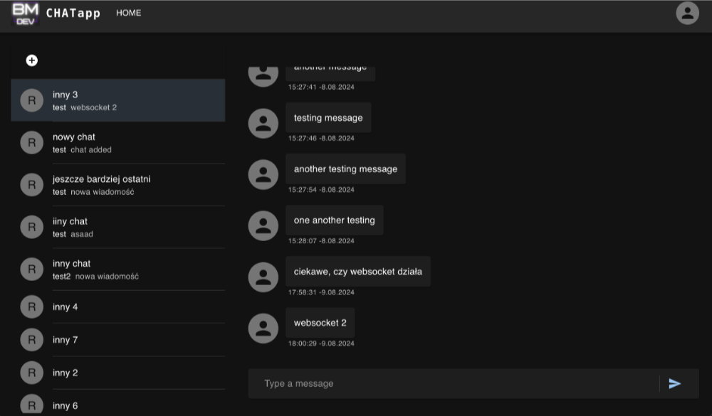

# Chatt App


## Description
Chatt App is a real-time messaging application built with React, Vite, and TypeScript. It leverages GraphQL for data querying and WebSocket for real-time communication. The user interface is designed using Material UI to provide a modern and responsive experience. Users can create an account, join chat rooms, and send messages in real-time.

## Technologies Used
- **React**: A JavaScript library for building user interfaces.
- **Vite**: A build tool that provides a faster and leaner development experience for modern web projects.
- **TypeScript**: A typed superset of JavaScript that compiles to plain JavaScript.
- **GraphQL**: A query language for your API, and a server-side runtime for executing queries by using a type system you define for your data.
- **WebSocket**: A protocol providing full-duplex communication channels over a single TCP connection.
- **Material UI**: A popular React UI framework that provides a set of components implementing Google's Material Design.

## Screenshot



## Installation and Running

1. Clone the repository
```bash
git clone https://github.com/yourusername/yourproject.git
```
2. Navigate to the project directory
```bash
cd yourproject
```

3. Install dependencies
```bash
npm install
```

4. Start the development server

```bash
npm run dev
```

5. Open your browser and visit
```bash
http://localhost:5173
```

### Important Note:

1. Ensure you update the `.env` file with the appropriate configuration.

2. In development mode uncomment the proxy server configuration in `vite.config.ts` file to avoid CORS issues.

3. The application requires a backend server to be running in order to function properly. Ensure you have the backend server running before starting the frontend application.

### .env Configuration

Ensure your `.env` file contains the following configuration:

```dotenv
VITE_APP_API_URL
VITE_APP_WS_URL
```

## Backend Repository

The backend for this application can be found in the following repository:

[Backend Repository](https://github.com/mariuszbee/chat-back)

### Future Improvements

- User profile management
- Private chat rooms
- Add email confirmation for new users